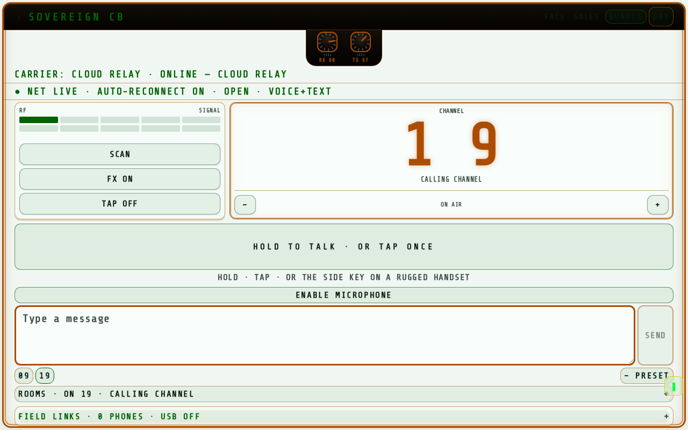
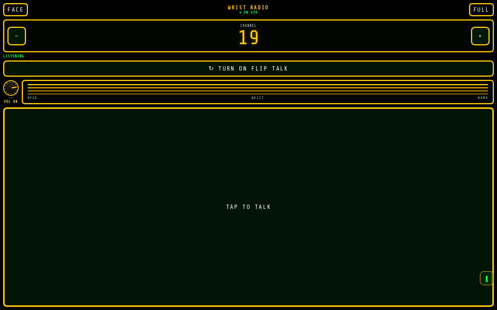
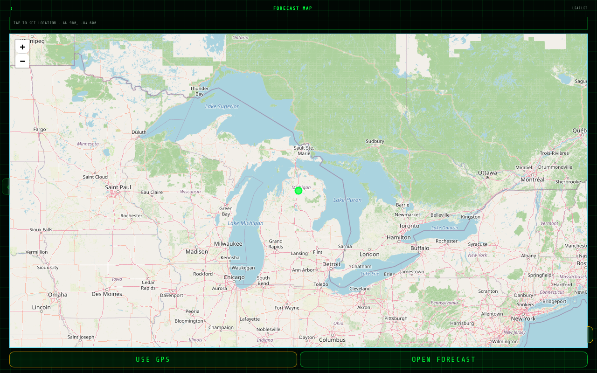
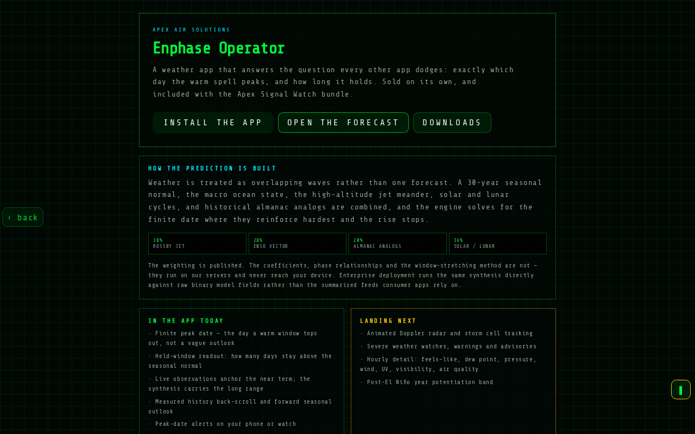

# Apex CB — community shell

The free, forkable shell of Apex Signal / TinyRadr: a browser CB radio deck,
offline-first PWA, live conditions and a public-data weather view. Fork it,
build something on it, make it better — and when you ship it commercially,
that is where the licence comes in.

## See it running

| Radio deck | Wrist radio |
| --- | --- |
|  |  |

| Forecast map | Weather |
| --- | --- |
|  |  |

## What is in here

- `src/routes/` — CB radio deck UI, watch faces, map, pricing page, store and
  auth shells. The engine-showcase screens are not part of the shell.
- `src/components/` — UI primitives and the project chrome.
- `src/lib/cb-links.ts`, `src/lib/cb-routes.tsa, `src/lib/rooms.ts` — the
  carrier bus and room routing (public protocol surface). Rooms `19` / `19.1`
  / `19.1.1`, bus `ptt-<id>`; `tune()` takes `{ roomId, key }`.
- `src/lib/engines/tristar-addressing.ts` — the wire-format header carried on
  every digital-link frame (public protocol).
- `src/lib/pricing.ts` — display copy and tier data only.
- `public/cb.webmanifest` + icons, service worker — installable PWA assets.
- `src/routes/api/public/forecast.ts` — a direct Open-Meteo pass-through so
  the weather UI runs with no engine.

## What is deliberately NOT in here

The proprietary math. The synthesis engines, wave-collapse forecast logic,
the shield's scoring and timing parameters, the operator field scripts, token
minting, licence signing and device binding all live in the private tree and
compile into the licensed native build.

**The handset-to-handset daisy chain is licensed technology and is not in
this repo.** The local link bus (`src/lib/cb-links.ts`), the field-mesh
carrier, the USB serial radio bridge, the BLE bridge, local node discovery,
private invitations and squad position sharing are all stubs here. The free
shell carries traffic over the cloud relay only — two phones on the same
channel, like any walkie app. Multi-carrier device-to-device relay (hotspot
+ BLE + USB, one channel, no server) ships with a licensed build. Stub modules under `src/lib/engines/`
keep the shell's type surface intact and degrade gracefully; `src/lib/papers.ts`
is an empty stub — the paper library is private.

**The community shell is the dining room. The kitchen is not in this repo.**

## Quickstart

```sh
bun install        # or npm install / pnpm install
cp .env.example .env   # plug your own Supabase/Lovable Cloud project
bun run dev
```

The CB deck, watch faces and PWA install work with no backend at all. Auth,
the store catalogue and licence checks need the Supabase environment
variables — create your own project and fill them in.

## Contributor terms

- **Fork freely** for personal and non-commercial use.
- **Commercial use** — hosting it as a service, bundling it into a paid
  product, reselling it — requires a licence and revenue share. Contact the
  owner for terms.
- **Contributions back are welcome.** By opening a pull request you grant the
  project owner a perpetual licence to use your contribution in both the open
  and the private tree.
- **API keys** for the proprietary engines are issued per contributor, metered
  and revocable. The free tier covers community development; paid tiers are
  for anything shipping to end users. Request keys through the [manual application](https://tinyradr.com/api-access).

## Licence

See [LICENSE](LICENSE). Fork, learn, build, contribute — the protected math
and the operator scripts stay with the owner.

## The echelon ladder — fork in, climb up

This repo is the free rung. Every rung above it is unlocked by shipping, not
by asking:

| Rung | You did | You get |
| --- | --- | --- |
| E0 — Fork | Cloned the shell | 3 handsets, 40 channels, linear scan, public-data weather |
| E1 — First merged PR | One pull request merged upstream | Community API key (metered), 80 channels |
| E2 — Working feature | A feature the community actually uses | 160-channel block scanner |
| E3 — Viable endpoint | A fork that stands on its own | 270-channel recursive stack scanner |
| E4 — Commercial | You sell something built on the shell | Commercial API keys, revenue-share licence |

Keys are per-contributor, metered, and revocable. Request yours at
**https://tinyradr.com/api-access** — tell us your GitHub handle and what you
are building. Every request is reviewed by hand.

The multi-carrier handset-to-handset daisy chain is **not** on this ladder.
It is the top prize and ships only under a signed licence.

## Good first contributions

Pick one, open a PR, climb the ladder:

1. **Channel presets** — the deck ships with 09/19 presets; make presets
   user-editable and persisted (localStorage is fine).
2. **Scanner lock indicator** — when the linear scan hears traffic, flash the
   channel readout and chirp; the hook points are in `src/lib/cb-links.ts`.
3. **Watch-face polish** — `src/routes/wcb.tsx` is one big tap target; make
   the whole screen the key on viewports under 400px and keep it painted on
   dim watch WebViews.

Small, real, mergeable. One merged PR = E1.

## Come and get it

If you found this repo from a video or a post: yes, it really is a working
browser CB radio deck you can fork tonight. Star it, fork it, break it, send
a PR. The ladder above is real — the first merged pull request gets you a
key.

## Three addresses, three playful field editions

[TinyRadr](https://tinyradr.com) is the depot and Enphase weather entrance, [Encrypted CB](https://encryptedcb.com) is the urban CB entrance, and [Cast Net Mesh](https://castnetmesh.com) is the event-mesh entrance. The depot also lists [UAP Field Station](https://tinyradr.com/uap), [Halloween Ghost Station](https://tinyradr.com/ghost), and [Mystic 9 Ball](https://tinyradr.com/mystic-nine) as separate $9.99-once editions. These paid editions are **not included in this free fork**. The free radar, map, weather and CB remain available without them. Sandbox checkout and server-issued licence delivery still require end-to-end verification; production payment is not claimed here. Detector traces are available-sensor observations, not a 3D room scan or evidence of a paranormal or extraterrestrial cause; the nine ball is a symbolic game.

The founder observed three app experiences assembled in about 18 minutes using the shared Foundry workflow, Lovable vibe coding and AI-agent collaboration. This describes that session, not a reproducible benchmark. Foundry organizes policy, permitted engines, adapters, labeled evidence and app skins; protected math and token economics remain private.

Want to make the free shell cooler? Start with a good-first-contribution above, add a failing-device reproduction or accessibility test, and send a focused PR. Request engine access separately through the manual application; a fork or a PR does not by itself grant commercial rights or private IP.

## Badges and the contributors wall

The echelon ladder above tracks what you unlock. The badge ladder in
[BADGES.md](BADGES.md) tracks who you are: Contributor, Builder, Operator,
Assembly unlock, and the invitation-only daisy-chain licence. Badges are
awarded as PR labels by the owner and recorded here.

### Contributors wall

| Contributor | Badge | Merged work |
| --- | --- | --- |
| _your handle here_ | `level:contributor` | _your first merged PR_ |

One merged PR puts your name on this wall. See [CONTRIBUTING.md](CONTRIBUTING.md)
for the terms.
